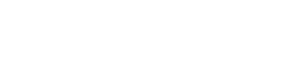

<div align="center">
    <h1>CommitAI</h1>
    <p><b>Writing commit messages has never been this easy!</b> Powered by <a href="https://gemini.google.com">Google Gemini</a></p>
    <br/>
    
    
    
    
    
    <br/>
    
</div>

## How it works
<div align="center">
    
</div>
<br/>

1. **Run `wcm`** from any project directory (optionally with context: `wcm "refactored auth module"`)
2. **Read working directory** — the script captures your current directory and passes it to CommitAI
3. **Validate git repo** — checks the directory is a valid git repository
4. **Init project in DB** — upserts the project into the database (tracked by path)
5. **Check `.gitignore`** — automatically adds `.commitai/*` entry if missing
6. **Load project context** — reads `.commitai/commitai.md` if it exists, for project-specific AI hints
7. **Fetch git changes**
   - Tracked changes via `git diff HEAD` (lock files excluded)
   - Untracked new files via `git ls-files --others`
8. **Send to AI** — builds a layered prompt:
   - System prompt (commit format rules)
   - Project context (if any)
   - User context from args (if any)
   - Git diff content
9. **AI returns a structured commit message array**
   - `[0]` Title — plain summary: `"Add database persistence for commits"`
   - `[1..n]` Body lines — typed format: `"- feat(db): add commits and stats tables"`
10. **Log to DB** — saves the commit messages and token usage stats
11. **Commit & push** — runs `git add .` → `git commit` → `git push`

## Result
[This commit message below](https://github.com/adwerygaming/commitai/commit/fee5ca6ee3a0f358bc809ee6e99108d5443ff5b7) was generated by CommitAI, based on the git changes. You can pass additional context to guide the AI towards a more specific style or focus area.

#### Console
```bash
~#@❯ wcm "few fixes"

> commit-ai@1.0.0 start
> npx tsx ./src/index.ts "few fixes"

[CommitAI] Generative Commit Message
[CommitAI] Additional user context provided: "few fixes"
[CommitAI] Project Name        : commitai
[CommitAI] Project path        : /home/masdepan/programming/commitai
[CommitAI] Working on branch   : dev
[CommitAI] Loaded commitai CommitAI.md

[Git] Found 258 lines of changes.

[AI] Generating using MasDepan's Proxy.
[AI] Sending to MasDepan's Proxy...
[AI] Elapsed: 12.335s (12335ms)
[AI] Parsed AI Contents: 11 changes

[Git] Added "." files on this project.

[Git] Commiting 11 changes.
[Git] Address several minor issues and improve code quality
[Git] - chore(env): remove unused DB_SSL configuration variables
[Git] - style(eslint): enforce consistent type imports with new rule
[Git] - refactor(typescript): use type-only imports for better clarity
[Git] - fix(git): correctly await isRepo() call in fetchGitChanges
[Git] - refactor(git): improve line count calculation for git changes
[Git] - fix(git): add try-catch block for robust push operation
[Git] - fix(cli): use success exit code for successful program termination
[Git] - fix(projects): improve project name extraction using path.basename
[Git] - docs(context): fix typos in CommitAI.md informational messages
[Git] - fix(scripts): ensure arguments are passed correctly in shell scripts

[Git] Pushing to branch dev...

[CommitAI] OK!
```

#### Output
```bash
Address several minor issues and improve code quality
- chore(env): remove unused DB_SSL configuration variables
- style(eslint): enforce consistent type imports with new rule
- refactor(typescript): use type-only imports for better clarity
- fix(git): correctly await isRepo() call in fetchGitChanges
- refactor(git): improve line count calculation for git changes
- fix(git): add try-catch block for robust push operation
- fix(cli): use success exit code for successful program termination
- fix(projects): improve project name extraction using path.basename
- docs(context): fix typos in CommitAI.md informational messages
- fix(scripts): ensure arguments are passed correctly in shell scripts
```

### Requirements
- A Laptop / Computer
- OS: Linux / Windows
- Node.js v21+
- Git installed and available in PATH
- Docker & Docker Compose

> [!IMPORTANT]
> Docker here is required for hosting the database (postgres). See [the docker compose file](./docker/docker-compose.yml) for details. You can also connect to an external Postgres instance by setting the appropriate environment variables.

### Installation
1. Clone the repository:
    ```bash
    git clone https://adwerygaming/commitai.git
    cd commitai
    ```
2. Install dependencies:
    ```bash
    npm install
    ```
3. Copy [`.env.example`](./.env.example) to `.env` and fill in the required environment variables.
4. Do the same for docker, copy [`.env.example`](./docker/.env.example) to `docker/.env` and fill in the required environment variables for the database connection.
5. Start the database using Docker Compose:
    ```bash
    cd docker
    docker-compose up -d
    ```
    Make sure the database is running and accessible with the credentials you provided in the `.env` file.
6. Setup the `wcm` command. Please follow the instructions below depending on your OS
    <details>
    <summary><b>Linux</b></summary>

    1. Make the shell script executable:
        ```bash
        chmod +x wcm.sh
        ```
    2. Open `wcm.sh` and update the `cd` path to match where you cloned the repository:
        ```bash
        cd /your/path/to/commitai || exit 1
        ```
    3. Add an alias to your shell config (`~/.bashrc`, `~/.zshrc`, etc.):
        ```bash
        alias wcm='/your/path/to/commitai/wcm.sh'
        ```
    4. Reload your shell config:
        ```bash
        source ~/.zshrc  # or ~/.bashrc
        ```
    5. You can now run `wcm` from any git project directory!
    </details>

    <details>
    <summary><b>Windows</b></summary>

    1. Open `wcm.bat` and update the `cd` path to match where you cloned the repository:
        ```bat
        cd /d "C:\Your\Path\To\commitai" || exit /b 1
        ```
    2. Add the `commitai` directory to your system `PATH`:
        - Open **Start** → search **"Environment Variables"**
        - Under **System variables**, find `Path` → click **Edit**
        - Click **New** and add the full path to your `commitai` folder (e.g. `C:\Your\Path\To\commitai`)
        - Click **OK** to save
    3. Open a new terminal and you can now run `wcm` from any git project directory!
    </details>

> [!NOTE]
> If you're wondering, wcm stands for "Write Commit Message".

### Usage
1. Navigate to any git project directory:
    ```bash
    cd /path/to/your/git/project
    ```
2. Run `wcm` with an optional **user context** — a short one-line hint passed as an argument to guide the AI:
    ```bash
    wcm "refactored auth module"
    ```
    The user context is a quick, per-run message. Use it to hint at what you changed or what tone the commit message should have.
3. The AI will generate a commit message based on the git changes and the provided context, then automatically commit and push the changes. [See example output above](#result).

> [!IMPORTANT]
> The output quality depends on **user context** (the argument you pass) and **project context** (the `.commitai/commitai.md` file, recommended to set up). Without either, the AI will generate a more generic commit message based solely on the git diff.

### Customizing AI Behavior (Project Context)
You can create a `.commitai/commitai.md` file in the **root of your project** (where you run `wcm`) to provide **project context** — persistent, project-specific instructions that are sent to the AI on every run.

Useful things to put in it:
- What the project is about
- Preferred commit message style or tone
- Areas or modules to pay special attention to
- Anything else that helps the AI understand your project better

CommitAI will automatically add `.commitai/*` to your `.gitignore` so the file stays local.

### Contributing
Contributions are welcome! Please open an issue or submit a pull request with your improvements.